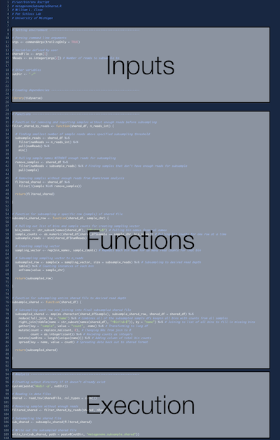

# Code Review - Subsampling metagenomic shared files in R

## Introduction

One of the last steps in my viral metagenomic pipeline is to rarefy my shared files to ensure even sampling
across samples. This process is slightly different from 16S pipelines because the read counts need to be normalized
based on bin lengths after subsampling but before downstream modeling.

 

 

In this repo, I have provided a basic script that I've used for the subsampling process in addition to the
expected input/output files. The script is divided up into three main parts as seen below:

 

 

## Tasks

For this code review, I need help with the following two areas:

<table>
<thead>
<tr>
<th>Theme</th>
<th>Goals</th>
<th>Teams</th>
</tr>
</thead>
<tbody>
<tr>
<td>Defensive programming</td>
<td>1. Validate inputs   2. Add progress messages   3. Add warning messages </td>
<td>1. Pat and Josh   2. Begüm and Lucas </td>
</tr>
<tr>
<td>General code improvement</td>
<td>1. Increase speed   2. Increase efficiency   3. Reduce complexity </td>
<td>1. Nick and Ari   2. Kelly and Sarah </td>
</tr>
</tbody>
</table>

Groups will be given 30 min to work on their tasks and the last 20 min (5 min/group) will be used for discussion. Please create a branch of this repo and submit your work as a pull request when finished.
